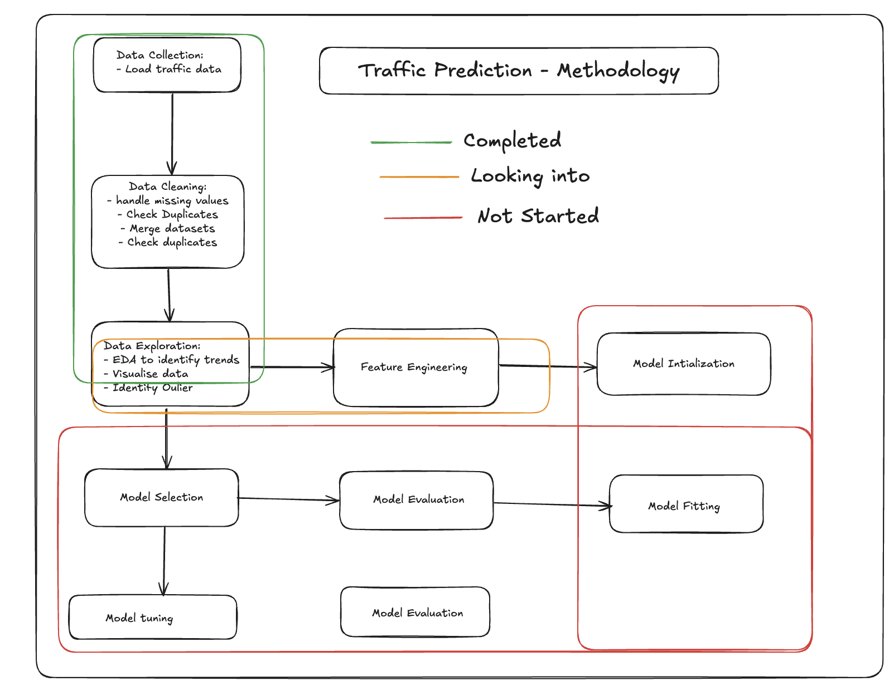

## Project Title
=========================

### Executive Summary

Traffic congestion is a growing issue in urban areas, resulting in longer travel times, increased fuel consumption, and higher environmental pollution. With urbanization and rising vehicle ownership, the strain on existing infrastructure is increasing. This project aims to tackle the problem of traffic congestion in the United Kingdom.

The project aims to address the challenge of analyzing and predicting vehicle counts, speeds, and congestion levels collected at regular intervals (hourly, daily, weekly, or monthly). This analysis is crucial for providing insights to help local authorities, commuters, city planners, and policymakers optimize traffic flow, manage congestion, and enhance infrastructure usage.


### Define the problem

The project's goal is to analyze and predict vehicle counts collected at regular intervals (hourly, daily, weekly, or monthly). Accurate traffic volume predictions are crucial for local authorities, commuters, and planners to optimize traffic flow, reduce congestion, and improve infrastructure use.

By identifying patterns in vehicle counts and traffic flow dynamics, stakeholders can:
- Identify high-traffic periods and bottlenecks to reduce congestion.
- Improve traffic safety by managing speeds and high-risk areas.
- Plan infrastructure upgrades to better accommodate traffic demand.

### Data science opportunity

This project presents a valuable opportunity to apply data science techniques to traffic data, enabling the following:

Traffic Volume Forecasting: Building models to predict future traffic volumes based on historical data, factoring in time, day, and road characteristics.
Anomaly Detection: Identifying unusual traffic patterns in congested areas to guide targeted interventions.
Scenario Analysis: Simulating the effects of infrastructure changes or policies on traffic to support evidence-based decisions.
Resource Optimization: Improving resource allocation for traffic lights, road maintenance, and public transport by understanding traffic demand dynamics.

### Key takeaways

**Key Models:**

- XGBoost: Best performance with a SMAPE of 82.93%.
- Prophet: Handles seasonality well, SMAPE of 99.07%.
- Naive Model: Simple benchmark, SMAPE of 82.37%.

**Features Used:**
- Road types, Year averages, Lagged traffic volumes, and Date-based features like day of the week.

**Technologies:**
- Python language.
- XGBoost, Prophet, pandas, matplotlib.

**Setup:**
- Clone repo: git clone https://github.com/brainstation-datascience/capstone-Emillia-rosette.git

**Results:**

- XGBoost performed much better than the other two models, especially with added features like road types and lagged traffic data.

**Future Work:**
- Add weather, real-time data.
- Explore deep learning models for more complex patterns (e.g., LSTM).


### Datasets Overview

<!-- ... This project uses two primary datasets accessed from the UK Department for Transport.  -->

The following document provides an overview of the road traffic data, including variable definitions, data structures, and methodologies used in the collection and processing of traffic data across the UK.
[Full Documentation PDF](https://storage.googleapis.com/dft-statistics/road-traffic/all-traffic-data-metadata.pdf)

<!-- 1. Local Authority Traffic Estimates

| **Variable Name**        | **Description**                                                                                       |
|--------------------------|-------------------------------------------------------------------------------------------------------|
| `local_authority_id`      | Website local authority identifier.                                                                   |
| `local_authority_name`    | The name of the local authority.                                                                      |
| `local_authority_code`    | The Office for National Statistics code identifier for the local authority.                           |
| `year`                    | Traffic estimates are shown for each year from 1993 onwards.                                          |
| `link_length_km`          | Total length of the road network road link for that local authority (in kilometres).                  |
| `link_length_miles`       | Total length of the network road link for that local authority (in miles).                            |
| `cars_and_taxis`          | Annual road traffic estimate for cars and taxis in the given local authority.                         |
| `all_motor_vehicles`      | Annual road traffic estimate for all motor vehicles in the given local authority.                     | -->

1. Traffic Count Data

| **Variable Name**           | **Description**                                                                                                                                       |
|-----------------------------|-------------------------------------------------------------------------------------------------------------------------------------------------------|
| `count_point_id`            | A unique reference for the road link that links the AADFs to the road network.                                                                         |
| `direction_of_travel`       | Direction of travel (e.g., North, South, East, West).                                                                                                  |
| `year`                      | Counts are shown for each year from 2000 onwards.                                                                                                      |
| `count_date`                | The date when the actual count took place.                                                                                                             |
| `hour`                      | The time when the counts in questions took place where 7 represents between 7am and 8am, and 17 represents between 5pm and 6pm.                         |
| `region_id`                 | Website region identifier.                                                                                                                             |
| `region_name`               | The name of the Region that the Count Point (CP) sits within.                                                                                           |
| `region_ons_code`           | The Office for National Statistics code identifier for the region.                                                                                      |
| `local_authority_id`        | Website local authority identifier.                                                                                                                    |
| `local_authority_name`      | The local authority that the CP sits within.                                                                                                            |
| `local_authority_code`      | The Office for National Statistics code identifier for the local authority.                                                                             |
| `road_name`                 | This is the road name (for instance, M25 or A3).                                                                                                        |
| `road_category`             | The classification of the road type (e.g., Motorway, Class A, Minor road).                                                                              |
| `road_type`                 | Whether the road is a ‘major’ or ‘minor’ road.                                                                                                          |
| `start_junction_road_name`  | The road name of the start junction of the link.                                                                                                        |
| `end_junction_road_name`    | The road name of the end junction of the link.                                                                                                          |
| `easting`                   | Easting coordinates of the CP location.                                                                                                                 |
| `northing`                  | Northing coordinates of the CP location.                                                                                                                |
| `latitude`                  | Latitude of the CP location.                                                                                                                            |
| `longitude`                 | Longitude of the CP location.                                                                                                                           |
| `link_length_km`            | Total length of the network road link for that CP (in kilometres).                                                                                      |
| `link_length_miles`         | Total length of the network road link for that CP (in miles).                                                                                           |
| `pedal_cycles`              | Counts for pedal cycles.                                                                                                                                |
| `two_wheeled_motor_vehicles`| Counts for two-wheeled motor vehicles.                                                                                                                  |
| `cars_and_taxis`            | Counts for cars and taxis.                                                                                                                              |
| `buses_and_coaches`         | Counts for buses and coaches.                                                                                                                           |
| `LGVs`                      | Counts for Light Goods Vehicles (LGVs).                                                                                                                 |
| `HGVs_2_rigid_axle`         | Counts for two-rigid axle Heavy Goods Vehicles (HGVs).                                                                                                  |
| `HGVs_3_rigid_axle`         | Counts for three-rigid axle HGVs.                                                                                                                       |
| `HGVs_4_or_more_rigid_axle` | Counts for four or more rigid axle HGVs.                                                                                                                |
| `HGVs_3_or_4_articulated_axle`| Counts for three or four-articulated axle HGVs.                                                                                                      |
| `HGVs_5_articulated_axle`   | Counts for five-articulated axle HGVs.                                                                                                                  |
| `HGVs_6_articulated_axle`   | Counts for six-articulated axle HGVs.                                                                                                                   |
| `all_HGVs`                  | Counts for all HGVs.                                                                                                                                    |
| `all_motor_vehicles`        | Counts for all motor vehicles.                                                                                                                          |
| `Month`                     | The month when the traffic count was recorded.                                                                                                          |
| `Day_of_Week`               | The day of the week when the traffic count was recorded.                                                                                                |
| `Day`                       | The specific day of the month when the traffic count was recorded.                                                                                      |
<!-- 
#### Road Definitions
- **Major Roads**: Includes motorways and all class ‘A’ roads. These roads usually have high traffic flows and are often the main arteries to major destinations.
  - **Motorways**: Built under the enabling legislation of the Special Roads Act 1949, now consolidated in the Highways Acts of 1959 and 1980. These include major roads of regional and urban strategic importance, often used for long-distance travel.
  - **‘A’ Roads**: These can be trunk or principal roads, often described as the 'main' roads.
    - **Trunk Roads**: Designated by the Trunk Roads Acts 1936 and 1946. Most motorways and many long-distance rural ‘A’ roads are trunk roads.
    - **Principal Roads**: Maintained by local authorities, these are significant roads, including some motorways.

- **Minor Roads**: These include ‘B’ and ‘C’ classified roads and unclassified roads, all of which are maintained by local authorities.
  - **‘B’ Roads**: In urban areas, can have relatively high traffic flows but are not regarded as significant as 'A' roads.
  - **‘C’ Roads**: Regarded as of lesser importance than ‘B’ or ‘A’ roads, generally having only one carriageway of two lanes and carrying less traffic.
  - **Unclassified Roads**: Includes residential roads both in urban and rural situations, typically with low traffic flows. -->

<!-- #### Types of Vehicle
- **All_MV**: All Motor Vehicles
- **2WMV**: Two-wheeled motor vehicles (e.g., motorcycles)
- **Car**: Cars and Taxis
- **LGV**: Light Goods Vans
- **HGV**: Heavy Goods Vehicle total
  - **HGVR2**: 2-rigid axle Heavy Goods Vehicle
  - **HGVR3**: 3-rigid axle Heavy Goods Vehicle
  - **HGVR4**: 4 or more rigid axle Heavy Goods Vehicle
  - **HGVA3**: 3 and 4-articulated axle Heavy Goods Vehicle
  - **HGVA5**: 5-articulated axle Heavy Goods Vehicle
  - **HGVA6**: 6 or more articulated axle Heavy Goods Vehicle
- **PC**: Pedal Cycles
<!--  -->

<!-- #### Vehicle Type Definitions
- **All Motor Vehicles**: All vehicles except pedal cycles.
- **Cars and Taxis**: Includes passenger vehicles with nine or fewer seats, three-wheeled cars, and four-wheel-drive ‘sports utility vehicles’ (SUV).
- **Motorcycles etc**: Includes motorcycles, scooters, and mopeds.
- **Buses and Coaches**: Includes all public service vehicles and works buses over 3.5 tonnes.
- **Light Vans**: Goods vehicles not exceeding 3.5 tonnes gross vehicle weight.
- **Heavy Goods Vehicles (HGV)**: Includes all goods vehicles over 3.5 tonnes gross vehicle weight.
  - **Rigid Heavy Goods Vehicles**: Includes rigid HGVs with varying numbers of axles.
  - **Articulated Heavy Goods Vehicles**: Classified based on the number of axles on the road. --> -->


### Demo
<!-- 
... Show your work:
...     Data visualisations
...     Interactive demo (e.g., stremlit app)
...     Short video of users trying out the solution -->


### Methodology

<!-- ... High-level diagrams of entire process:
...     various data processing steps
...     various modelling directions
...     various prototyping directions -->



### Organization

#### Repository 
├
- `LICENSE`
  - Project license
- `Makefile`
  - Automation script for the project
- `README.md`
  - Project landing page (this page)
- `conda.yml`
  - Conda environment specification
- `data`
  - Contains link to a copy of the dataset (stored in a publicly accessible Google Drive folder)
  - Saved copy of aggregated/processed data as long as those are not too large (> 10 MB)
  - `essex_map.json`
  - `pd_count_points_cleaned.csv`
  - `pd_raw_count_cleaned.csv`
  - `uk_data`
    - `dft_traffic_counts_raw_counts.csv`
    - `local_authority_traffic.csv`
  - `uk_shape.shp`
  - `uk_shapefiles_by_counties`
    - `TermsAndConditions.html`
    - `infuse_cnty_lyr_2011_clipped.dbf`
    - `infuse_cnty_lyr_2011_clipped.prj`
    - `infuse_cnty_lyr_2011_clipped.shp`
    - `infuse_cnty_lyr_2011_clipped.shx`
- `data_dictionary.md`
  - Contains data dictionary for the project
- `docs`
  - Contains the final report which summarizes the project
  - `figures`
    - `project-flowchart.svg`
- `model`
  - Joblib dump of final model/model object
  - `sentiment-model.pkl`
- `notebooks`
  - Contains all final notebooks involved in the project
  - `01-data-loading-cleaning.ipynb`
  - `02-eda.ipynb`
  - `02-region-east.ipynb`
  - `03-pre-processing.ipynb`
  - `04-modelling.ipynb`
  - `05-findings.ipynb`
- `references`
  - Contains papers/tutorials used in the project
  - `papers.md`
- `src`
  - Contains the project source code (refactored from the notebooks)
  - `__init__.py`
  - `data`
    - `__init__.py`
    - `make_dataset.py`
  - `features`
    - `__init__.py`
    - `build_features.py`
  - `models`
    - `__init__.py`
    - `predict_model.py`
    - `train_model.py`
  - `visualization`
    - `__init__.py`
    - `visualize.py`
- `topo_eer.json`
- `topo_wpc.json`
- `traffic_prediction_presentation.pptx`

### Credits & References

- Department for Transport. (n.d.) All Traffic Data Metadata. Available at: https://storage.googleapis.com/dft-statistics/road-traffic/all-traffic-data-metadata.pdf (2024).
- Williams, D. (2023) 'Sadiq Khan says London's congestion problems are improving despite complaints of traffic jams', Daily Mail, 5 August. Available at: https://www.dailymail.co.uk/news/article-13566731/Sadiq-Khan-London-congestion-roads-traffic.html (Accessed: 4 August 2024)

------------------------------------------------------------------------------
#### Usage

This is a template repository for quickly setting up a data science project
It includes a simple folder structure and a conda environment for isolated dependency management.

1. Start a new repo using this template
2. Update your `LICENSE` file.
3. Update your `README.md` file. 
4. Set up and activate conda environment
    1. Rename your conda environment in the `./conda.yml` file.
    2. Add/change any dependencies and their versions in the `./conda.yml` file.
    3. Set up your conda environment and activate it by running:
        ```bash
        conda env create -f conda.yml
        conda activate <your-env-name>
        ```
5. Add your own scripts in `./src/`
6. Add your own notebooks in `./notebooks/`
7. Add your own data in `./data/`
    gitignore will ignore the data folder when you push to github
    save a copy of your raw and process data, 
    pickled models in a Google Drive folder
    and add the link in the gdrive-links.md file
8. Add your project documents, reports, presentation pdfs in the `./docs`
9. Add your references (tutorials, papers, books etc.) in `./references` 